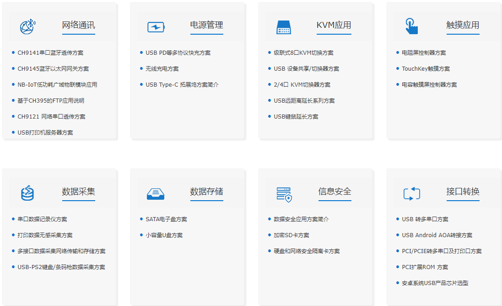
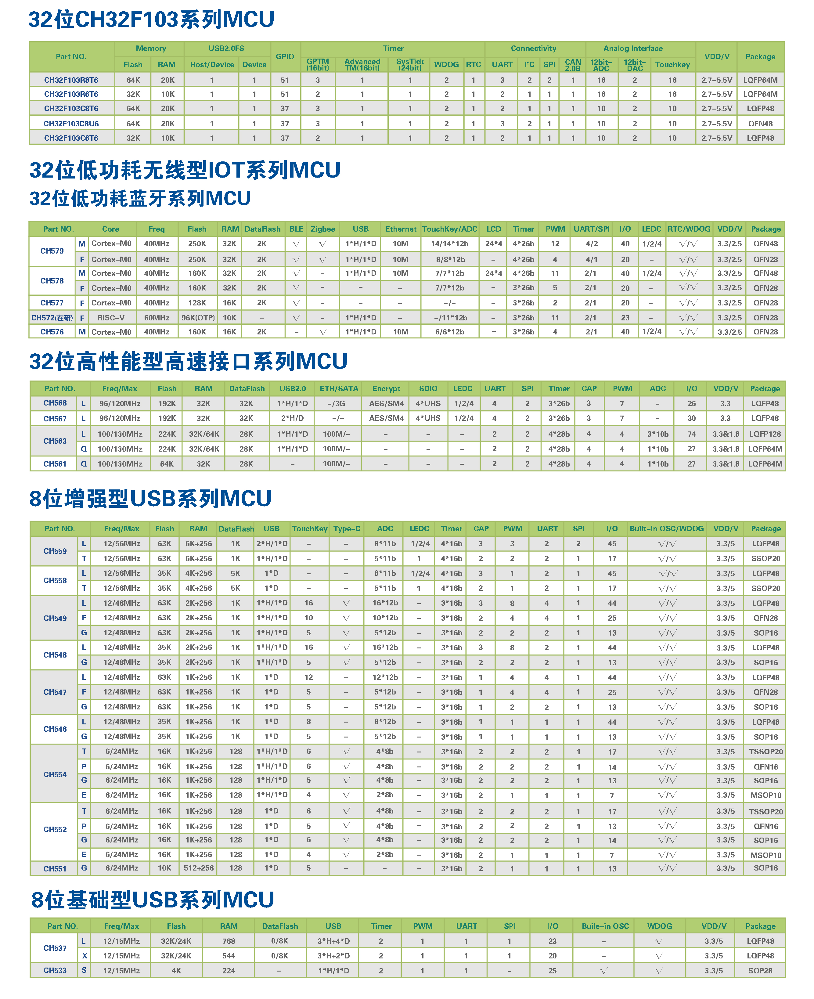

# [WCH](https://github.com/SoCXin/WCH)

## [厂商简介](https://github.com/SoCXin/WCH/wiki)

南京沁恒微电子[WCH](http://www.wch.cn/) 是一家集成电路设计公司，主要产品包括：有线网络、无线网络、USB和PCI类接口芯片以及集成上述接口的单片机。

###  [SoC芯平台](http://www.SoC.Xin)
