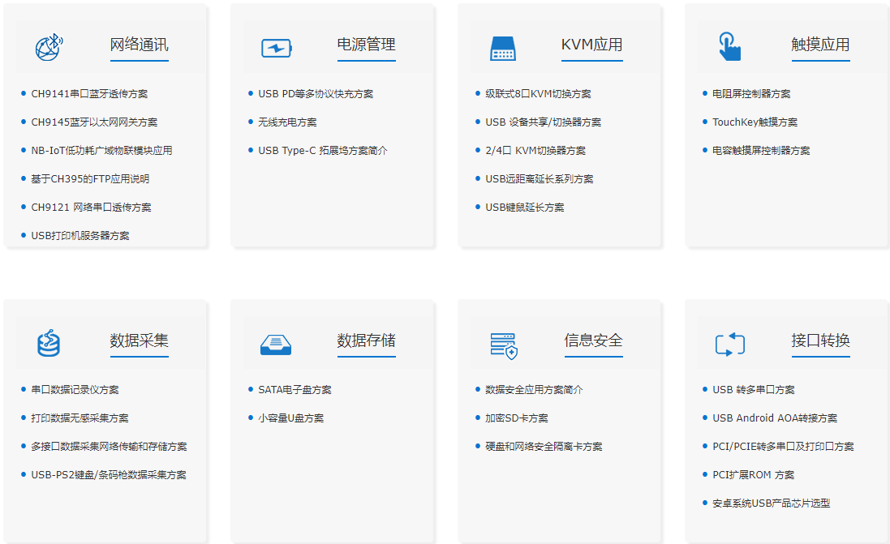

# [WCH](https://github.com/sochub/WCH)

 
#### 父级：[vendor](https://github.com/sochub/vendor)

## [厂商简介](https://github.com/sochub/WCH/wiki) 

[南京沁恒WCH](http://www.wch.cn/) 是一家集成电路设计公司，主要产品包括：有线网络、无线网络、USB和PCI类接口芯片以及集成上述接口的单片机。

 

### [资源收录](https://github.com/sochub/WCH)

* [参考文档](docs/)
	* [选型手册](http://www.wch.cn/downloads/PRODUCT_GUIDE_PDF.html)
* [工具资源](tools/)
    * [ISP工具](tools/ISP)

## [单片机产品系列](http://www.wch.cn/products/category/5.html)

* 8051系列
    * [CH54x](https://github.com/sochub/CH54)
    * [CH55x](https://github.com/sochub/CH55)
* arm cortex系列
    * [CH56x](https://github.com/sochub/CH56)
    * [CH57x](https://github.com/sochub/CH57)

###  [SoC资源平台](http://www.qitas.cn)
